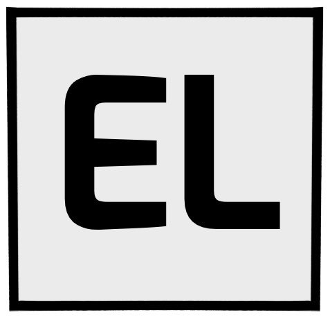

<!-- AUTO-GENERATED-CONTENT:START (STARTER) -->

  

<h1 align="center">
  Responsive Portfolio Website
</h1>

Thank you for checking out this github repo of my responsive portfolio website! Follow this link see the finished product: <a href='https://ethanlee123.netlify.app/'>https://ethanlee123.netlify.app/</a> 

## General Info
***
This development process began with mockups designed in Figma, while also learning new technologies such as Gatsby and GraphQL. It was and still is an iterative process and I'll continue with further refinements. As always, I am open to feedback, so feel free to send me a message.

## Technologies
***
* Javascript / Html5 / Css3
* React with Gatsby
* GraphQL

## Attributions
***
* [Lamp background image](https://unsplash.com/photos/pxoZSTdAzeU) by Pierre Châtel-Innocenti [Unsplash License](https://unsplash.com/license)
* [Electric car charger](https://unsplash.com/photos/2JvEjF0tf50) by Andrew Roberts [Unsplash License](https://unsplash.com/license)
* [Drone in hand](https://unsplash.com/photos/onhDEr_g29M) by Jonathan Chng [Unsplash License](https://unsplash.com/license)
* [Mountains Advanced Uav card](https://unsplash.com/photos/fNClQ4pRlaE) by Caspar Camille Rubin [Unsplash License](https://unsplash.com/license)
* [Map on CodeHunter card](https://unsplash.com/photos/fk9r2Ec5bSI) by Suhash Villuri [Unsplash License](https://unsplash.com/license)
* [Deadlift on Peak Physique card](https://unsplash.com/photos/WvDYdXDzkhs) by Victor Freitas [Unsplash License](https://unsplash.com/license)
* [Drone Icon on Advanced Uav card](https://www.freepik.com/premium-vector/realistic-drone-illustration-white-background_8792254.htm) by sicuta [Freepik License](https://www.freepikcompany.com/legal#nav-freepik)
* [Casino table on Monte Carlo card](https://unsplash.com/photos/GikVY_KS9vQ) by Michal Parzuchowski [Unsplash License](https://unsplash.com/license)
* [Red Dice on Monte Carlo card](https://www.megapixl.com/dice-illustration-13534668) by Soniaeps [Royalty-Free License of use of Non-Watermarked Media and Restrictions](Royalty-Free License of use of Non-Watermarked Media and Restrictions)
* [Yoga pose on Peak Physique card](https://www.stickpng.com/img/sports/yoga/yoga-exercise) by unknown [StickPNG](https://www.stickpng.com/tos)
* [Svg logos under My Skills](https://www.vectorlogo.zone/logos/w3_html5/) by Community contribution ([VectorLogoZone](https://github.com/VectorLogoZone/vectorlogozone))

